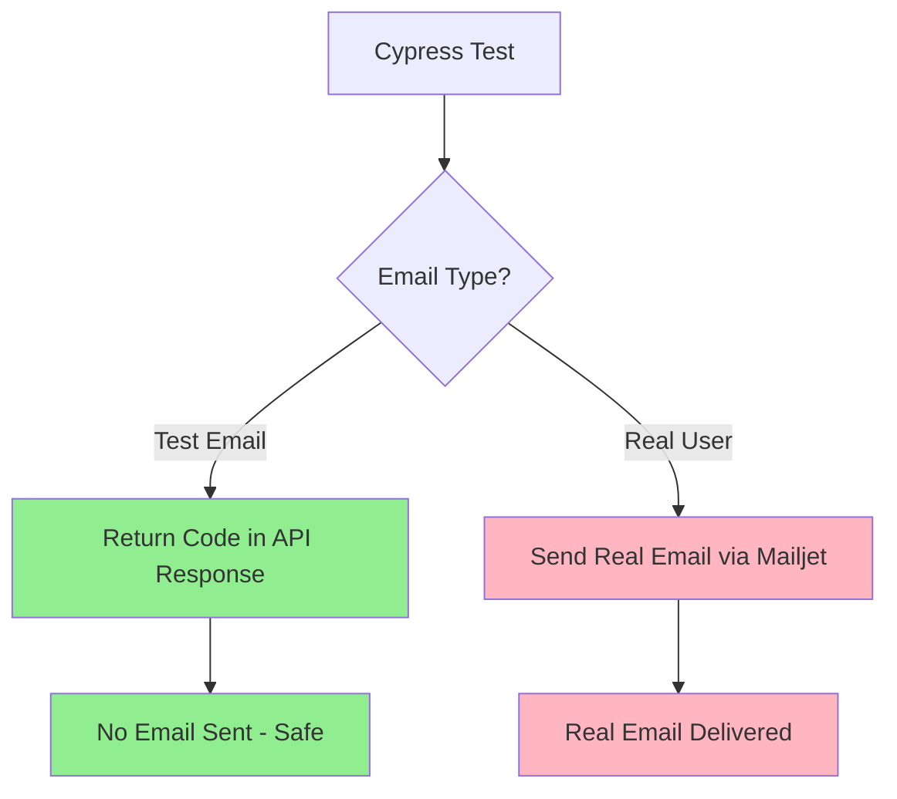
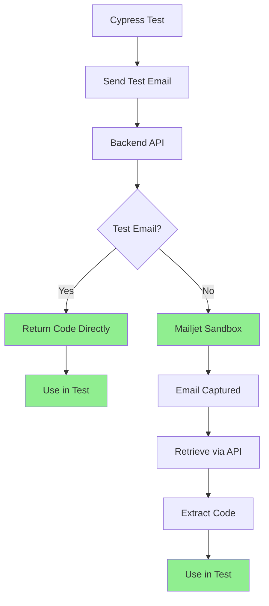

# Mailjet Test Emails for Cypress Testing

## Overview

This project uses **Mailjet's sandbox mode** to send test emails that can be retrieved via API for Cypress testing. This approach works for both **development** and **production** environments, providing a reliable way to test email functionality without sending emails to real users.

## 🛡️ **CRITICAL SAFETY FEATURE: NO REAL EMAILS SENT**

### ✅ **Cypress Tests Are Completely Safe**
- **Cypress tests NEVER send real emails to recipients**
- **All test emails use sandbox mode or direct API responses**
- **Only production real users receive actual emails**

### ✅ **Email Safety Mechanisms**
1. **Test Email Detection**: Backend automatically detects test emails (containing `a1143179+`, `test@`, or `cypress`)
2. **Development Mode**: In development, codes are returned directly in API responses
3. **Sandbox Mode**: Test emails use Mailjet sandbox mode (captured but not delivered)
4. **Separate Endpoints**: Test-specific endpoints (`/send-test-email`) for Cypress testing

## 🎯 Key Features

### ✅ **Sandbox Mode**
- Emails are captured by Mailjet but **not delivered** to recipients
- Perfect for testing without spam or unwanted emails
- Works in both development and production

### ✅ **API Retrieval**
- Retrieve sent emails via Mailjet API
- Extract verification codes automatically
- Built-in retry logic for reliability

### ✅ **Cypress Integration**
- Custom Cypress commands for email testing
- Automatic code extraction and verification
- Works with existing test infrastructure

## 🛠️ Setup Instructions

### 1. **Mailjet Configuration**

Add your Mailjet credentials to the configuration files:

```json
// backend/appsettings.Development.json
{
  "Mailjet": {
    "ApiKey": "YOUR_MAILJET_API_KEY",
    "ApiSecret": "YOUR_MAILJET_API_SECRET",
    "FromEmail": "noreply@bloodsugartracker.dev",
    "FromName": "Blood Sugar Tracker (Dev)"
  }
}
```

```json
// backend/appsettings.json (Production)
{
  "Mailjet": {
    "ApiKey": "YOUR_MAILJET_API_KEY",
    "ApiSecret": "YOUR_MAILJET_API_SECRET",
    "FromEmail": "noreply@yourdomain.com",
    "FromName": "Blood Sugar Tracker"
  }
}
```

### 2. **Get Mailjet API Keys**

1. Sign up at [Mailjet.com](https://www.mailjet.com/)
2. Go to your [API Key Management](https://app.mailjet.com/account/api_keys)
3. Copy your **API Key** and **API Secret**
4. Add them to your configuration files

### 3. **Verify Sender Email**

1. Go to [Sender & Domains](https://app.mailjet.com/account/sender)
2. Add and verify your sender email address
3. This email will be used as the "From" address

## 🧪 How It Works

### **Email Safety Flow**



### **Development vs Production vs Testing**

| Environment | Email Behavior | Code Retrieval | Real Email Sent |
|-------------|----------------|----------------|-----------------|
| **Development** | Returns code in API response | Direct from API | ❌ **NEVER** |
| **Cypress Tests** | Sandbox mode or API response | Via API | ❌ **NEVER** |
| **Production Real Users** | Sends via Mailjet | Via Mailjet API | ✅ **YES** |

### **Email Flow**



## 📧 API Endpoints

### **Send Test Email (SAFE - NO REAL EMAIL)**
```http
POST /api/auth/send-test-email
Content-Type: application/json

{
  "email": "test@example.com"
}
```

**Response:**
```json
{
  "message": "Test email sent successfully",
  "code": "123456"
}
```

### **Send Verification (Production Only)**
```http
POST /api/auth/send-verification
Content-Type: application/json

{
  "email": "realuser@example.com"
}
```

**Response (Development/Test):**
```json
{
  "message": "Verification code sent",
  "code": "123456"
}
```

**Response (Production Real User):**
```json
{
  "message": "Verification code sent"
}
```

### **Retrieve Email Code**
```http
GET /api/auth/retrieve-email-code/{email}
```

**Response:**
```json
{
  "code": "123456",
  "email": "test@example.com"
}
```

## 🧪 Cypress Usage

### **Basic Usage (SAFE)**

```javascript
import { mailjetTestUtils } from '../support/mailjet-test-utils';

// Send test email and get code (NO REAL EMAIL SENT)
mailjetTestUtils.sendTestEmailAndGetCode('test@example.com')
  .then((code) => {
    cy.log(`Verification code: ${code} (NO REAL EMAIL DELIVERED)`);
    // Use code in your test
  });
```

### **Wait for Email with Retry (SAFE)**

```javascript
// Wait for email to be available (with retry logic)
mailjetTestUtils.waitForEmailCode('test@example.com', 10, 1000)
  .then((code) => {
    cy.log(`Retrieved code: ${code} (sandbox mode)`);
  });
```

### **Complete Email Verification Flow (SAFE)**

```javascript
// Complete the full flow (NO REAL EMAILS SENT)
mailjetTestUtils.completeEmailVerificationFlow('test@example.com')
  .then((code) => {
    // Code is automatically retrieved and verified
    cy.log(`Used code: ${code} (sandbox mode only)`);
  });
```

### **Custom Cypress Commands (ALL SAFE)**

```javascript
// Send test email (NO REAL EMAIL SENT)
cy.sendTestEmail('test@example.com').then((code) => {
  // Use code
});

// Retrieve email code (sandbox mode)
cy.retrieveEmailCode('test@example.com').then((code) => {
  // Use code
});

// Wait for email code (sandbox mode)
cy.waitForEmailCode('test@example.com', 10, 1000).then((code) => {
  // Use code
});

// Complete verification (sandbox mode)
cy.completeEmailVerification('test@example.com').then((code) => {
  // Use code
});

// Verify no real emails are sent
cy.verifyNoRealEmailsSent('test@example.com');
```

## 📝 Example Test (SAFE)

```javascript
describe('Email Verification Test (NO REAL EMAILS)', () => {
  it('should register user with test email verification', () => {
    const email = `test+${Date.now()}@example.com`;
    
    // Navigate to registration
    cy.visit('/register');
    
    // Enter email and send verification (NO REAL EMAIL SENT)
    cy.get('input[name="email"]').type(email);
    cy.contains('Send Code').click();
    
    // Wait for email and get code (sandbox mode)
    mailjetTestUtils.waitForEmailCode(email, 10, 1000).then((code) => {
      // Enter verification code
      cy.get('input[name="code"]').type(code);
      cy.contains('Verify').click();
      
      // Complete registration
      cy.get('input[name="password"]').type('TestPassword123');
      cy.get('input[name="confirmPassword"]').type('TestPassword123');
      cy.get('form').submit();
      
      // Verify success
      cy.url().should('include', '/dashboard');
    });
  });
});
```

## 🔧 Configuration Options

### **Environment Variables**

```bash
# Development
REACT_APP_API_URL=http://localhost:3000
REACT_APP_MAILJET_TEST_MODE=true

# Production
REACT_APP_API_URL=https://your-app.azurewebsites.net
REACT_APP_MAILJET_TEST_MODE=true
```

### **Cypress Configuration**

```javascript
// cypress.config.js
module.exports = {
  e2e: {
    baseUrl: 'http://localhost:3000',
    env: {
      mailjetTestMode: true,
      apiBaseUrl: 'http://localhost:3000'
    }
  }
};
```

## 🚀 Production Testing

### **Benefits for Production**

1. **Real Email Infrastructure**: Tests use actual Mailjet API
2. **No Spam**: Sandbox mode prevents real email delivery
3. **Reliable**: API-based retrieval is more reliable than email parsing
4. **Scalable**: Works with any number of test emails
5. **Cost-Effective**: Uses Mailjet's free tier effectively
6. **Safe**: **NEVER sends real emails during testing**

### **Production Setup**

```javascript
// Production test configuration
const productionConfig = {
  apiBaseUrl: 'https://your-app.azurewebsites.net',
  mailjetTestMode: true,
  maxRetries: 15,
  retryDelay: 2000
};

// Use in tests (SAFE - NO REAL EMAILS)
mailjetTestUtils.waitForEmailCode(email, 15, 2000, productionConfig.apiBaseUrl);
```

## 🔍 Troubleshooting

### **Common Issues**

#### **1. Email Not Found**
```javascript
// Increase retry attempts and delay
mailjetTestUtils.waitForEmailCode(email, 20, 2000);
```

#### **2. API Key Issues**
```bash
# Check Mailjet dashboard for API key status
# Verify sender email is confirmed
# Check API key permissions
```

#### **3. Rate Limiting**
```javascript
// Add delays between email requests
cy.wait(3000); // Wait 3 seconds between emails
```

#### **4. Code Extraction Fails**
```javascript
// Check email template format
// Verify regex patterns in MailjetTestService
// Check email content in Mailjet dashboard
```

### **Debug Steps**

1. **Check Mailjet Dashboard**
   - Go to [Mailjet Activity](https://app.mailjet.com/activity)
   - Verify emails are being sent (sandbox mode)
   - Check for any errors

2. **Test API Endpoints**
   ```bash
   # Test send endpoint (SAFE - NO REAL EMAIL)
   curl -X POST http://localhost:3000/api/auth/send-test-email \
     -H "Content-Type: application/json" \
     -d '{"email":"test@example.com"}'
   
   # Test retrieve endpoint
   curl http://localhost:3000/api/auth/retrieve-email-code/test@example.com
   ```

3. **Check Logs**
   ```bash
   # Backend logs
   dotnet run --environment Development
   
   # Cypress logs
   npx cypress run --spec "cypress/e2e/1-registration.cy.js"
   ```

## 📊 Monitoring

### **Mailjet Dashboard Metrics**

- **Email Activity**: Track sent, delivered, opened emails
- **API Usage**: Monitor API calls and limits
- **Error Rates**: Check for failed email sends
- **Performance**: Monitor email processing times

### **Test Metrics**

```javascript
// Track test performance
const startTime = Date.now();
mailjetTestUtils.waitForEmailCode(email).then((code) => {
  const duration = Date.now() - startTime;
  cy.log(`Email retrieval took ${duration}ms (sandbox mode)`);
});
```

## 💰 Cost Considerations

### **Mailjet Free Tier**
- **200 emails/day** (6,000/month)
- **Perfect for development and testing**
- **No cost for sandbox emails**

### **Production Usage**
- **Pay per email** when exceeding free tier
- **Sandbox emails count toward quota**
- **Consider test email limits**

## 🔒 Security

### **Best Practices**

1. **Environment Variables**: Never commit API keys
2. **Sandbox Mode**: Always use sandbox for testing
3. **Rate Limiting**: Implement proper delays
4. **Error Handling**: Handle API failures gracefully
5. **Logging**: Monitor for suspicious activity
6. **Email Safety**: **NEVER send real emails during testing**

### **API Key Security**

```bash
# Use environment variables
export MAILJET_API_KEY="your-api-key"
export MAILJET_API_SECRET="your-api-secret"

# Or use Azure Key Vault (production)
# Or use User Secrets (development)
```

## 📋 Checklist

### **Setup Checklist**
- [ ] Create Mailjet account
- [ ] Get API keys
- [ ] Verify sender email
- [ ] Update configuration files
- [ ] Test API endpoints
- [ ] Run Cypress tests
- [ ] Monitor Mailjet dashboard
- [ ] **Verify no real emails are sent during testing**

### **Test Checklist**
- [ ] Email sending works (sandbox mode)
- [ ] Code retrieval works
- [ ] Retry logic works
- [ ] Error handling works
- [ ] Production deployment works
- [ ] Monitoring is set up
- [ ] **No real emails sent to test addresses**

## 🎉 Benefits

### **For Developers**
- ✅ **Realistic Testing**: Uses actual email infrastructure
- ✅ **Reliable**: API-based retrieval is more reliable
- ✅ **Fast**: No need to wait for real email delivery
- ✅ **Safe**: **NEVER sends real emails to test addresses**

### **For Production**
- ✅ **Confidence**: Tests real email functionality
- ✅ **Scalability**: Works with any number of tests
- ✅ **Cost-Effective**: Uses free tier effectively
- ✅ **Monitoring**: Full visibility into email operations
- ✅ **Safety**: **Only real users receive actual emails**

## 🛡️ **Email Safety Summary**

### **What Cypress Tests Do:**
- ✅ Use test email endpoints (`/send-test-email`)
- ✅ Use sandbox mode for Mailjet emails
- ✅ Return codes directly in API responses
- ✅ **NEVER send real emails to recipients**

### **What Production Does:**
- ✅ Send real emails only to actual users
- ✅ Use real Mailjet delivery (not sandbox)
- ✅ Handle real email verification flows

### **Safety Mechanisms:**
1. **Test Email Detection**: Backend identifies test emails automatically
2. **Development Mode**: Codes returned directly in development
3. **Sandbox Mode**: Test emails captured but not delivered
4. **Separate Endpoints**: Test-specific API endpoints
5. **Clear Logging**: All test operations clearly logged

This setup provides a professional, reliable, and **completely safe** way to test email functionality in both development and production environments! 